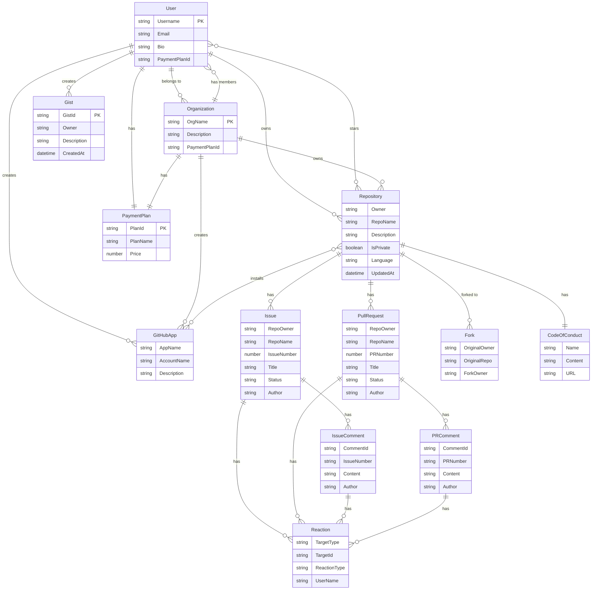

# GitHub DynamoDB Implementation

## Product Definition
Implementation of GitHub's complete data model using DynamoDB single table design patterns with DynamoDB-Toolbox for type-safe schema definitions and queries.

## Target Users
- Backend developers implementing GitHub-like data models
- Teams adopting DynamoDB single table design
- Developers learning complex NoSQL data modeling

## Core Features
1. **Complete Entity Model** - Users, Organizations, Repositories, Issues, PRs, Comments, Reactions, Gists, Apps
2. **Single Table Design** - All entities in one DynamoDB table with composite keys and multiple GSIs
3. **Type-Safe Queries** - DynamoDB-Toolbox entities with full TypeScript support
4. **Full Access Patterns** - Support for all GitHub operations and queries
5. **Layered Architecture** - API → Domain → Repository → DynamoDB layers

## Entity Relationship Diagram

## Main Table Entity Chart

| Entity | Partition Key (PK) | Sort Key (SK) | Entity Type |
|--------|-------------------|---------------|-------------|
| **Repository** | `REPO#<Owner>#<RepoName>` | `REPO#<Owner>#<RepoName>` | Repo |
| **Issue** | `ISSUE#<Owner>#<RepoName>#<ZeroPaddedIssueNumber>` | `ISSUE#<Owner>#<RepoName>#<ZeroPaddedIssueNumber>` | Issue |
| **Pull Request** | `PR#<Owner>#<RepoName>#<ZeroPaddedPRNumber>` | `PR#<Owner>#<RepoName>#<ZeroPaddedPRNumber>` | PullRequest |
| **Issue Comment** | `ISSUECOMMENT#<Owner>#<RepoName>#<IssueNumber>` | `ISSUECOMMENT#<CommentId>` | IssueComment |
| **PR Comment** | `PRCOMMENT#<Owner>#<RepoName>#<PRNumber>` | `PRCOMMENT#<CommentId>` | PRComment |
| **Reaction** | `<TargetType>REACTION#<Owner>#<RepoName>#<TargetId>#<UserName>` | `<TargetType>REACTION#<Owner>#<RepoName>#<TargetId>#<UserName>` | Reaction |
| **User** | `ACCOUNT#<Username>` | `ACCOUNT#<Username>` | User |
| **Organization** | `ACCOUNT#<OrgName>` | `ACCOUNT#<OrgName>` | Organization |
| **Membership** | `ACCOUNT#<OrgName>` | `MEMBERSHIP#<Username>` | Membership |
| **Gist** | `ACCOUNT#<Username>` | `GIST#<GistId>` | Gist |
| **GitHub App** | `APP#<AccountName>#<AppName>` | `APP#<AccountName>#<AppName>` | GitHubApp |
| **App Installation** | `APP#<AccountName>#<AppName>` | `REPO#<RepoOwner>#<RepoName>` | GitHubAppInstallation |

## GSI1 Index

| Entity | GSI1PK | GSI1SK | Purpose |
|--------|--------|--------|---------|
| **Repository** | `REPO#<Owner>#<RepoName>` | `REPO#<Owner>#<RepoName>` | Query by repo |
| **Issue** | `ISSUE#<Owner>#<RepoName>` | `ISSUE#<ZeroPaddedIssueNumber>` | List issues by repo |
| **Pull Request** | `PR#<Owner>#<RepoName>` | `PR#<ZeroPaddedPRNumber>` | List PRs by repo |
| **User** | `ACCOUNT#<Username>` | `ACCOUNT#<Username>` | Account queries |
| **Organization** | `ACCOUNT#<OrgName>` | `ACCOUNT#<OrgName>` | Account queries |
| **GitHub App** | `ACCOUNT#<AccountName>` | `APP#<AppName>` | Apps by account |
| **App Installation** | `REPO#<RepoOwner>#<RepoName>` | `REPOAPP#<AppOwner>#<AppName>` | Apps by repo |

## GSI2 Index

| Entity | GSI2PK | GSI2SK | Purpose |
|--------|--------|--------|---------|
| **Repository** | `REPO#<Owner>#<RepoName>` | `REPO#<Owner>#<RepoName>` | Repo lookup |
| **Fork** | `REPO#<OriginalOwner>#<RepoName>` | `FORK#<Owner>` | Find forks of repo |

## GSI3 Index

| Entity | GSI3PK | GSI3SK | Purpose |
|--------|--------|--------|---------|
| **Repository** | `ACCOUNT#<AccountName>` | `#<UpdatedAt>` | Recent repos by account |
| **User** | `ACCOUNT#<Username>` | `ACCOUNT#<Username>` | User lookup |
| **Organization** | `ACCOUNT#<OrgName>` | `ACCOUNT#<OrgName>` | Org lookup |

## GSI4 Index (After Migration)

| Entity | GSI4PK | GSI4SK | Purpose |
|--------|--------|--------|---------|
| **Repository** | `REPO#<Owner>#<RepoName>` | `#REPO#<Owner>#<RepoName>` | Repo metadata |
| **Open Issue** | `ISSUE#<Owner>#<RepoName>` | `ISSUE#OPEN#<ZeroPaddedIssueNumberDiff>` | Open issues by repo (sorted newest first) |
| **Closed Issue** | `ISSUE#<Owner>#<RepoName>` | `#ISSUE#CLOSED#<ZeroPaddedIssueNumber>` | Closed issues by repo (sorted oldest first) |

**Note:** Issue and PR numbers support up to 99,999,999 (8 digits). Open issues use reverse numbering (`99999999 - issue_number`) for newest-first sorting.

## Supported Access Patterns

### Repository Operations
- Get/Create Repository
- Fork Repository
- Get Forks for Repository
- Add Code of Conduct

### Issue & PR Operations
- Get/Create/List Issues for Repo
- Get/Create/List Pull Requests for Repo
- Fetch Open/Closed Issues
- Fetch Open/Closed Pull Requests

### Interaction Operations
- Add Comment to Issue
- Add Comment to Pull Request
- Add Reaction to Issue/PR/Comment
- Star Repository
- Get Stargazers for Repo

### User & Organization Management
- Create User
- Create Organization
- Add User to Organization
- Get Users for Organization
- Get Organizations for User

### Account Repository Queries
- Get Repos for User
- Get Repos for Organization

### Gist Operations
- Create Gist
- View Gists for User

### GitHub App Operations
- Create GitHub App
- Install GitHub App to Repo
- View GitHub App Installations
- View GitHub Apps for Repo

## Key Design Patterns

1. **Single Table Design** - All entities in one table with composite keys
2. **Item Collections** - Related items share the same partition key
3. **Overloaded Attributes** - `ACCOUNT#` prefix serves both Users and Organizations
4. **Zero-Padding** - Issue/PR numbers padded for proper lexicographic sorting
5. **Adjacency List** - Many-to-many relationships via separate items (e.g., Memberships, App Installations)
6. **Sparse Indexes** - GSIs only contain items with the indexed attributes
7. **Composite Sort Keys** - Enable complex query patterns and sorting

## Success Metrics
- All GitHub entities modeled correctly
- All access patterns from ERD implemented
- Type-safe queries throughout the application
- Performance optimized with proper GSI usage
- Complete test coverage for all operations
