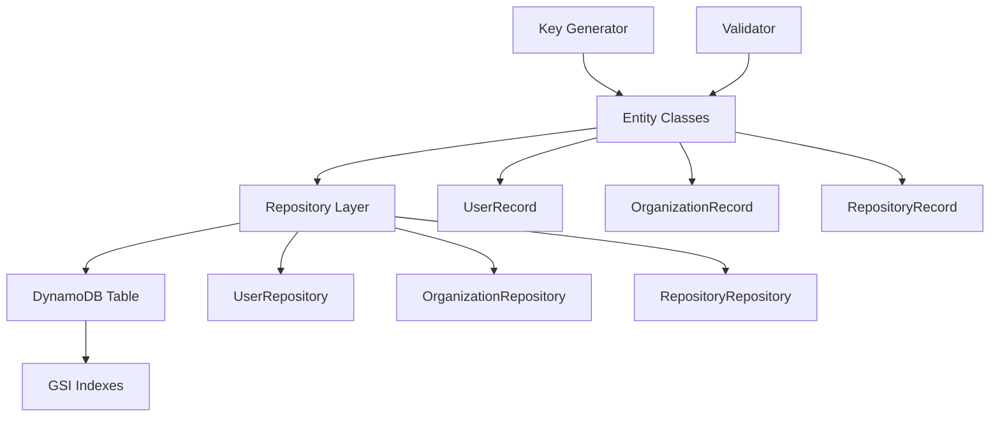

# Core Entities Design Specification

## Feature Overview

The core-entities feature provides the foundational data layer for a GitHub-like application using DynamoDB as the primary data store. This feature implements three core entity types (User, Organization, Repository) with a single-table design pattern, enabling efficient querying and scalable data access patterns.

**Purpose**: Establish the fundamental domain entities and data access layer that will serve as the foundation for all other features including issues, pull requests, and comments.

## Architecture

### Component Relationships



### Data Flow

1. **Request → Entity**: Input validation and transformation using entity `fromRequest()` methods
2. **Entity → Record**: Data transformation using entity `toRecord()` methods for DynamoDB persistence
3. **Repository → Database**: CRUD operations through DynamoDB-Toolbox
4. **Database → Entity**: Record retrieval and transformation using entity constructors
5. **Entity → Response**: Output formatting using entity `toResponse()` methods

## Domain Model

### Entity Definitions with DynamoDB-Toolbox Schemas

#### UserRecord Schema

```typescript
import { Entity } from 'dynamodb-toolbox'

const UserRecord = new Entity({
  name: 'User',
  attributes: {
    PK: { 
      type: 'string', 
      partitionKey: true,
      default: ({ username }: { username: string }) => `ACCOUNT#${username}`
    },
    SK: { 
      type: 'string', 
      sortKey: true,
      default: ({ username }: { username: string }) => `ACCOUNT#${username}`
    },
    GSI1PK: { 
      type: 'string',
      default: ({ username }: { username: string }) => `ACCOUNT#${username}`
    },
    GSI1SK: { 
      type: 'string',
      default: ({ username }: { username: string }) => `ACCOUNT#${username}`
    },
    GSI3PK: { 
      type: 'string',
      default: ({ username }: { username: string }) => `ACCOUNT#${username}`
    },
    GSI3SK: { 
      type: 'string',
      default: ({ username }: { username: string }) => `ACCOUNT#${username}`
    },
    username: { 
      type: 'string', 
      required: true,
      validate: (value: string) => /^[a-zA-Z0-9_-]+$/.test(value)
    },
    email: { 
      type: 'string', 
      required: true,
      validate: (value: string) => /^[^\s@]+@[^\s@]+\.[^\s@]+$/.test(value)
    },
    bio: { type: 'string' },
    payment_plan_id: { type: 'string' },
    created_at: { 
      type: 'string', 
      required: true,
      default: () => new Date().toISOString()
    },
    updated_at: { 
      type: 'string', 
      required: true,
      default: () => new Date().toISOString()
    }
  }
} as const)
```

#### OrganizationRecord Schema

```typescript
const OrganizationRecord = new Entity({
  name: 'Organization',
  attributes: {
    PK: { 
      type: 'string', 
      partitionKey: true,
      default: ({ org_name }: { org_name: string }) => `ACCOUNT#${org_name}`
    },
    SK: { 
      type: 'string', 
      sortKey: true,
      default: ({ org_name }: { org_name: string }) => `ACCOUNT#${org_name}`
    },
    GSI1PK: { 
      type: 'string',
      default: ({ org_name }: { org_name: string }) => `ACCOUNT#${org_name}`
    },
    GSI1SK: { 
      type: 'string',
      default: ({ org_name }: { org_name: string }) => `ACCOUNT#${org_name}`
    },
    GSI3PK: { 
      type: 'string',
      default: ({ org_name }: { org_name: string }) => `ACCOUNT#${org_name}`
    },
    GSI3SK: { 
      type: 'string',
      default: ({ org_name }: { org_name: string }) => `ACCOUNT#${org_name}`
    },
    org_name: { 
      type: 'string', 
      required: true,
      validate: (value: string) => /^[a-zA-Z0-9_-]+$/.test(value)
    },
    description: { type: 'string' },
    payment_plan_id: { type: 'string' },
    created_at: { 
      type: 'string', 
      required: true,
      default: () => new Date().toISOString()
    },
    updated_at: { 
      type: 'string', 
      required: true,
      default: () => new Date().toISOString()
    }
  }
} as const)
```

#### RepositoryRecord Schema

```typescript
const RepositoryRecord = new Entity({
  name: 'Repository',
  attributes: {
    PK: { 
      type: 'string', 
      partitionKey: true,
      default: ({ owner, repo_name }: { owner: string; repo_name: string }) => 
        `REPO#${owner}#${repo_name}`
    },
    SK: { 
      type: 'string', 
      sortKey: true,
      default: ({ owner, repo_name }: { owner: string; repo_name: string }) => 
        `REPO#${owner}#${repo_name}`
    },
    GSI1PK: { 
      type: 'string',
      default: ({ owner, repo_name }: { owner: string; repo_name: string }) => 
        `REPO#${owner}#${repo_name}`
    },
    GSI1SK: { 
      type: 'string',
      default: ({ owner, repo_name }: { owner: string; repo_name: string }) => 
        `REPO#${owner}#${repo_name}`
    },
    GSI2PK: { 
      type: 'string',
      default: ({ owner, repo_name }: { owner: string; repo_name: string }) => 
        `REPO#${owner}#${repo_name}`
    },
    GSI2SK: { 
      type: 'string',
      default: ({ owner, repo_name }: { owner: string; repo_name: string }) => 
        `REPO#${owner}#${repo_name}`
    },
    GSI3PK: { 
      type: 'string',
      default: ({ owner }: { owner: string }) => `ACCOUNT#${owner}`
    },
    GSI3SK: { 
      type: 'string',
      default: ({ updated_at }: { updated_at: string }) => `#${updated_at}`
    },
    owner: { 
      type: 'string', 
      required: true,
      validate: (value: string) => /^[a-zA-Z0-9_-]+$/.test(value)
    },
    repo_name: { 
      type: 'string', 
      required: true,
      validate: (value: string) => /^[a-zA-Z0-9_.-]+$/.test(value)
    },
    description: { type: 'string' },
    is_private: { 
      type: 'boolean', 
      required: true,
      default: false
    },
    language: { type: 'string' },
    created_at: { 
      type: 'string', 
      required: true,
      default: () => new Date().toISOString()
    },
    updated_at: { 
      type: 'string', 
      required: true,
      default: () => new Date().toISOString()
    }
  }
} as const)
```

## Database Design

### Table Structure

| Attribute | Type | Description |
|-----------|------|-------------|
| PK | String (Partition Key) | Primary partition key |
| SK | String (Sort Key) | Primary sort key |
| GSI1PK | String | GSI1 partition key |
| GSI1SK | String | GSI1 sort key |
| GSI2PK | String | GSI2 partition key |
| GSI2SK | String | GSI2 sort key |
| GSI3PK | String | GSI3 partition key |
| GSI3SK | String | GSI3 sort key |
| GSI4PK | String | GSI4 partition key (reserved) |
| GSI4SK | String | GSI4 sort key (reserved) |

### Global Secondary Indexes (GSIs)

| GSI | Partition Key | Sort Key | Purpose |
|-----|---------------|----------|---------|
| GSI1 | GSI1PK | GSI1SK | Account queries, repo queries |
| GSI2 | GSI2PK | GSI2SK | Repo lookup, fork relationships |
| GSI3 | GSI3PK | GSI3SK | Recent repos by account, user/org lookup |
| GSI4 | GSI4PK | GSI4SK | Reserved for future repo metadata queries |

### Access Patterns

| Pattern | Method | Key Pattern | Index | Example |
|---------|--------|-------------|-------|---------|
| Get User by Username | GetItem | `PK=ACCOUNT#{username}` | Main Table | `ACCOUNT#octocat` |
| Get Organization by Name | GetItem | `PK=ACCOUNT#{org_name}` | Main Table | `ACCOUNT#github` |
| Get Repository by Owner/Name | GetItem | `PK=REPO#{owner}#{repo_name}` | Main Table | `REPO#octocat#Hello-World` |
| List Repos by Owner | Query | `GSI3PK=ACCOUNT#{owner}` | GSI3 | `ACCOUNT#octocat` |
| Recent Repos by Owner | Query | `GSI3PK=ACCOUNT#{owner}`, sort by `GSI3SK` | GSI3 | Sort by timestamp |
| List All Accounts | Scan | `PK` begins_with `ACCOUNT#` | Main Table | Filter scan |

### Sparse Index Usage

GSI attributes are only populated when the entity uses that specific index:

- **User/Organization**: Only populate GSI1 and GSI3 keys
- **Repository**: Populate GSI1, GSI2, and GSI3 keys
- **GSI4**: Reserved for future use, no current population

## Repository Layer

### UserRepository

```typescript
interface UserRepository {
  create(userData: CreateUserRequest): Promise<UserRecord>
  get(username: string): Promise<UserRecord | null>
  update(username: string, updates: UpdateUserRequest): Promise<UserRecord>
  delete(username: string): Promise<void>
  getByUsername(username: string): Promise<UserRecord | null>
}

class UserRepositoryImpl implements UserRepository {
  constructor(private table: Table) {}

  async create(userData: CreateUserRequest): Promise<UserRecord> {
    const user = UserRecord.build(userData)
    await this.table.entities.User.put(user)
    return user
  }

  async get(username: string): Promise<UserRecord | null> {
    const result = await this.table.entities.User.get({
      PK: `ACCOUNT#${username}`,
      SK: `ACCOUNT#${username}`
    })
    return result.Item || null
  }

  async update(username: string, updates: UpdateUserRequest): Promise<UserRecord> {
    const result = await this.table.entities.User.update({
      PK: `ACCOUNT#${username}`,
      SK: `ACCOUNT#${username}`
    }, {
      ...updates,
      updated_at: new Date().toISOString()
    })
    return result.Attributes
  }

  async delete(username: string): Promise<void> {
    await this.table.entities.User.delete({
      PK: `ACCOUNT#${username}`,
      SK: `ACCOUNT#${username}`
    })
  }

  async getByUsername(username: string): Promise<UserRecord | null> {
    return this.get(username)
  }
}
```

### OrganizationRepository

```typescript
interface OrganizationRepository {
  create(orgData: CreateOrganizationRequest): Promise<OrganizationRecord>
  get(orgName: string): Promise<OrganizationRecord | null>
  update(orgName: string, updates: UpdateOrganizationRequest): Promise<OrganizationRecord>
  delete(orgName: string): Promise<void>
  getByOrgName(orgName: string): Promise<OrganizationRecord | null>
}

class OrganizationRepositoryImpl implements OrganizationRepository {
  constructor(private table: Table) {}

  async create(orgData: CreateOrganizationRequest): Promise<OrganizationRecord> {
    const org = OrganizationRecord.build(orgData)
    await this.table.entities.Organization.put(org)
    return org
  }

  async get(orgName: string): Promise<OrganizationRecord | null> {
    const result = await this.table.entities.Organization.get({
      PK: `ACCOUNT#${orgName}`,
      SK: `ACCOUNT#${orgName}`
    })
    return result.Item || null
  }

  async update(orgName: string, updates: UpdateOrganizationRequest): Promise<OrganizationRecord> {
    const result = await this.table.entities.Organization.update({
      PK: `ACCOUNT#${orgName}`,
      SK: `ACCOUNT#${orgName}`
    }, {
      ...updates,
      updated_at: new Date().toISOString()
    })
    return result.Attributes
  }

  async delete(orgName: string): Promise<void> {
    await this.table.entities.Organization.delete({
      PK: `ACCOUNT#${orgName}`,
      SK: `ACCOUNT#${orgName}`
    })
  }

  async getByOrgName(orgName: string): Promise<OrganizationRecord | null> {
    return this.get(orgName)
  }
}
```

### RepositoryRepository

```typescript
interface RepositoryRepository {
  create(repoData: CreateRepositoryRequest): Promise<RepositoryRecord>
  get(owner: string, repoName: string): Promise<RepositoryRecord | null>
  update(owner: string, repoName: string, updates: UpdateRepositoryRequest): Promise<RepositoryRecord>
  delete(owner: string, repoName: string): Promise<void>
  getByOwnerAndName(owner: string, repoName: string): Promise<RepositoryRecord | null>
  listByOwner(owner: string, limit?: number): Promise<RepositoryRecord[]>
}

class RepositoryRepositoryImpl implements RepositoryRepository {
  constructor(private table: Table) {}

  async create(repoData: CreateRepositoryRequest): Promise<RepositoryRecord> {
    const repo = RepositoryRecord.build(repoData)
    await this.table.entities.Repository.put(repo)
    return repo
  }

  async get(owner: string, repoName: string): Promise<RepositoryRecord | null> {
    const result = await this.table.entities.Repository.get({
      PK: `REPO#${owner}#${repoName}`,
      SK: `REPO#${owner}#${repoName}`
    })
    return result.Item || null
  }

  async update(owner: string, repoName: string, updates: UpdateRepositoryRequest): Promise<RepositoryRecord> {
    const result = await this.table.entities.Repository.update({
      PK: `REPO#${owner}#${repoName}`,
      SK: `REPO#${owner}#${repoName}`
    }, {
      ...updates,
      updated_at: new Date().toISOString()
    })
    return result.Attributes
  }

  async delete(owner: string, repoName: string): Promise<void> {
    await this.table.entities.Repository.delete({
      PK: `REPO#${owner}#${repoName}`,
      SK: `REPO#${owner}#${repoName}`
    })
  }

  async getByOwnerAndName(owner: string, repoName: string): Promise<RepositoryRecord | null> {
    return this.get(owner, repoName)
  }

  async listByOwner(owner: string, limit = 50): Promise<RepositoryRecord[]> {
    const result = await this.table.query('GSI3', {
      GSI3PK: `ACCOUNT#${owner}`,
      limit,
      scanIndexForward: false // Most recent first
    })
    return result.Items
  }
}
```

## Key Generation

### Composite Key Patterns

#### Account Keys (Users & Organizations)
```typescript
const generateAccountKeys = (name: string) => ({
  PK: `ACCOUNT#${name}`,
  SK: `ACCOUNT#${name}`,
  GSI1PK: `ACCOUNT#${name}`,
  GSI1SK: `ACCOUNT#${name}`,
  GSI3PK: `ACCOUNT#${name}`,
  GSI3SK: `ACCOUNT#${name}`
})
```

#### Repository Keys
```typescript
const generateRepositoryKeys = (owner: string, repoName: string, updatedAt: string) => ({
  PK: `REPO#${owner}#${repoName}`,
  SK: `REPO#${owner}#${repoName}`,
  GSI1PK: `REPO#${owner}#${repoName}`,
  GSI1SK: `REPO#${owner}#${repoName}`,
  GSI2PK: `REPO#${owner}#${repoName}`,
  GSI2SK: `REPO#${owner}#${repoName}`,
  GSI3PK: `ACCOUNT#${owner}`,
  GSI3SK: `#${updatedAt}`
})
```

### Collision Prevention

1. **Username/Organization Name Uniqueness**: Both use `ACCOUNT#` prefix, preventing name collisions
2. **Repository Uniqueness**: Composite key ensures unique repositories per owner
3. **Key Validation**: Entity validation ensures proper character sets and formats
4. **Case Sensitivity**: All keys are case-sensitive as stored

### KeyGenerator Utility

```typescript
class KeyGenerator {
  static account(name: string): string {
    if (!name || !/^[a-zA-Z0-9_-]+$/.test(name)) {
      throw new Error('Invalid account name format')
    }
    return `ACCOUNT#${name}`
  }

  static repository(owner: string, repoName: string): string {
    if (!owner || !repoName) {
      throw new Error('Owner and repository name are required')
    }
    if (!/^[a-zA-Z0-9_-]+$/.test(owner) || !/^[a-zA-Z0-9_.-]+$/.test(repoName)) {
      throw new Error('Invalid repository key format')
    }
    return `REPO#${owner}#${repoName}`
  }

  static timestampSortKey(timestamp: string): string {
    return `#${timestamp}`
  }
}
```

## Testing Strategy

### DynamoDB Local Setup

```typescript
// jest.config.js
module.exports = {
  setupFilesAfterEnv: ['<rootDir>/src/test-setup.ts'],
  testEnvironment: 'node'
}

// src/test-setup.ts
import { DynamoDBLocal } from 'dynamodb-local'

let dynamoLocal: any

beforeAll(async () => {
  dynamoLocal = await DynamoDBLocal.launch({
    port: 8000,
    inMemory: true
  })
})

afterAll(async () => {
  if (dynamoLocal) {
    await DynamoDBLocal.stop(dynamoLocal)
  }
})
```

### Test Patterns

#### Repository Testing
```typescript
describe('UserRepository', () => {
  let repository: UserRepository
  let table: Table

  beforeEach(async () => {
    // Setup table and repository
    table = createTestTable()
    repository = new UserRepositoryImpl(table)
  })

  test('should create user successfully', async () => {
    const userData = {
      username: 'testuser',
      email: 'test@example.com',
      bio: 'Test user bio'
    }

    const user = await repository.create(userData)
    
    expect(user.username).toBe('testuser')
    expect(user.PK).toBe('ACCOUNT#testuser')
    expect(user.created_at).toBeDefined()
  })

  test('should prevent duplicate usernames', async () => {
    const userData = { username: 'duplicate', email: 'test@example.com' }
    
    await repository.create(userData)
    
    await expect(repository.create(userData))
      .rejects.toThrow('ConditionalCheckFailedException')
  })
})
```

#### Data Factories
```typescript
class TestDataFactory {
  static user(overrides: Partial<CreateUserRequest> = {}): CreateUserRequest {
    return {
      username: `user_${Date.now()}`,
      email: `test_${Date.now()}@example.com`,
      bio: 'Test user bio',
      ...overrides
    }
  }

  static organization(overrides: Partial<CreateOrganizationRequest> = {}): CreateOrganizationRequest {
    return {
      org_name: `org_${Date.now()}`,
      description: 'Test organization',
      ...overrides
    }
  }

  static repository(overrides: Partial<CreateRepositoryRequest> = {}): CreateRepositoryRequest {
    return {
      owner: `owner_${Date.now()}`,
      repo_name: `repo_${Date.now()}`,
      description: 'Test repository',
      is_private: false,
      language: 'TypeScript',
      ...overrides
    }
  }
}
```

## Dependencies

### Production Dependencies

```json
{
  "dynamodb-toolbox": "^1.0.0",
  "@aws-sdk/client-dynamodb": "^3.0.0", 
  "@aws-sdk/lib-dynamodb": "^3.0.0"
}
```

### Development Dependencies

```json
{
  "dynamodb-local": "^2.0.0",
  "@types/jest": "^29.0.0",
  "@types/node": "^20.0.0"
}
```

### Table Configuration

```typescript
import { DynamoDBClient } from '@aws-sdk/client-dynamodb'
import { DynamoDBDocumentClient } from '@aws-sdk/lib-dynamodb'
import { Table } from 'dynamodb-toolbox'

const client = DynamoDBDocumentClient.from(new DynamoDBClient({
  region: process.env.AWS_REGION || 'us-east-1',
  ...(process.env.NODE_ENV === 'test' && {
    endpoint: 'http://localhost:8000'
  })
}))

const GitHubTable = new Table({
  name: 'GitHubTable',
  partitionKey: 'PK',
  sortKey: 'SK',
  indexes: {
    GSI1: { partitionKey: 'GSI1PK', sortKey: 'GSI1SK' },
    GSI2: { partitionKey: 'GSI2PK', sortKey: 'GSI2SK' },
    GSI3: { partitionKey: 'GSI3PK', sortKey: 'GSI3SK' }
  },
  DocumentClient: client
})
```

## Implementation Notes

### Important Considerations

1. **Key Validation**: All entity names must follow strict character set validation to prevent injection attacks and ensure URL compatibility

2. **Timestamp Consistency**: Use ISO 8601 format (`new Date().toISOString()`) for all timestamp fields to ensure proper sorting

3. **GSI Population Strategy**: Only populate GSI keys for entities that actually use those indexes to minimize storage costs

4. **Update Patterns**: Always update the `updated_at` timestamp on any entity modification to maintain proper GSI3 sorting

5. **Error Handling**: Implement proper error handling for:
   - Conditional check failures (duplicate keys)
   - Validation errors (invalid formats)
   - DynamoDB service errors (throttling, capacity)

### Constraints

1. **Single Table Design**: All entities share the same table structure
2. **Key Length Limits**: DynamoDB partition keys limited to 2048 bytes
3. **Item Size Limits**: Individual items cannot exceed 400KB
4. **GSI Projection**: All GSIs use ALL projection for simplicity
5. **Eventual Consistency**: GSI queries are eventually consistent

### Future Considerations

1. **GSI4 Usage**: Reserved for future repo metadata queries (stars, forks, etc.)
2. **Batch Operations**: Consider implementing batch read/write operations for efficiency
3. **Caching Layer**: May need caching for frequently accessed entities
4. **Backup Strategy**: Consider point-in-time recovery for production deployments