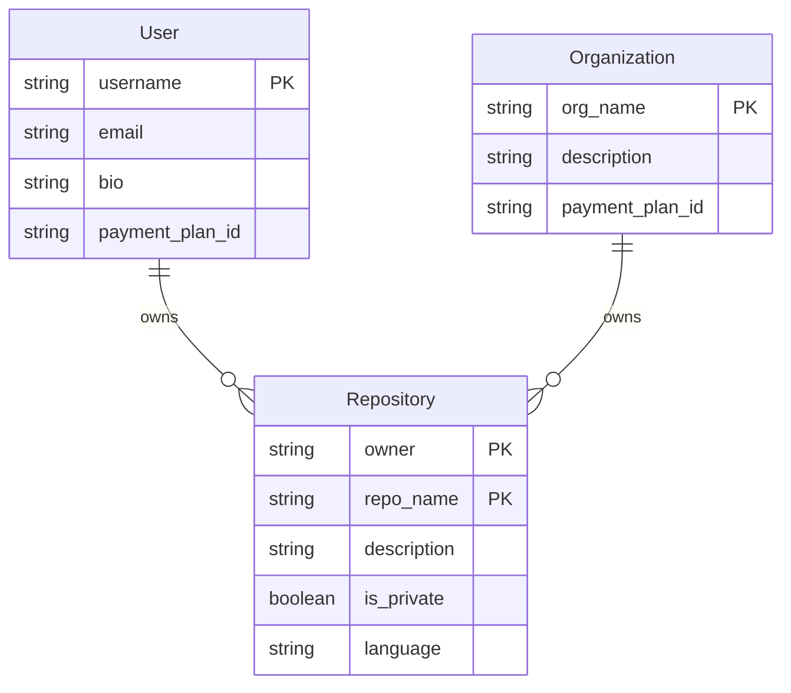

# Core Entities Feature Specification

## Feature Overview

**Feature:** core-entities
**User Story:** As a backend developer, I want to set up core DynamoDB entities (User, Organization, Repository) with proper table configuration so that I can build the foundation for the GitHub data model implementation.

This feature establishes the foundational data layer for our GitHub-style application using DynamoDB's single table design pattern. It implements the three core entity types that form the backbone of the system: Users, Organizations, and Repositories.

## Business Rules

### BR-1: Global Username/Organization Uniqueness
Usernames and organization names must be unique globally (enforced by ACCOUNT# prefix collision detection). This prevents naming conflicts and ensures clear identity resolution across the system.

### BR-2: Repository Name Uniqueness per Owner
Repository names must be unique per owner (enforced by REPO#<owner>#<reponame> composite key). This follows GitHub's model where repository names only need to be unique within an owner's namespace.

### BR-3: Composite Key Pattern Compliance
All primary and sort keys must follow the composite key patterns defined in the ERD. This ensures consistent access patterns and proper data distribution across partitions.

### BR-4: GSI Index Configuration
GSI indexes must be properly configured to support the defined access patterns for account and repository queries. Each GSI serves specific query patterns and must be optimized accordingly.

### BR-5: Sparse GSI Pattern
GSI attributes are only populated for entities that use those specific indexes (sparse GSI pattern). This optimizes storage costs and query performance by only indexing relevant data.

## Acceptance Criteria

### AC-1: User Entity with ACCOUNT Pattern
**GIVEN** I need to create a user
**WHEN** I create a User entity
**THEN** it uses `ACCOUNT#{username}` as PK and SK with global uniqueness enforcement

### AC-2: Organization Entity with ACCOUNT Pattern
**GIVEN** I need to create an organization
**WHEN** I create an Organization entity
**THEN** it uses `ACCOUNT#{org_name}` as PK and SK with global uniqueness enforcement

### AC-3: Repository Entity with REPO Pattern
**GIVEN** I need to create a repository
**WHEN** I create a Repository entity
**THEN** it uses `REPO#{owner}#{repo_name}` as PK and SK with owner-scoped uniqueness

### AC-4: GSI3 Repository Listing by Owner
**GIVEN** a user or organization owns multiple repositories
**WHEN** I query repositories by owner
**THEN** GSI3 enables efficient querying with `ACCOUNT#{owner}` as GSI3PK

### AC-5: Global Account Name Collision Prevention
**GIVEN** a username or organization name already exists
**WHEN** I attempt to create an entity with the same name
**THEN** DynamoDB conditional check prevents creation due to ACCOUNT# prefix collision

## Technical Implementation Details

### DynamoDB Table Design

#### Entity Relationship Diagram (ERD)

The core entities form the foundation of the GitHub-like data model:



#### Single Table Schema

| Entity | PK Pattern | SK Pattern | GSI1 | GSI2 | GSI3PK | GSI3SK |
|--------|------------|------------|------|------|--------|---------|
| User | `ACCOUNT#{username}` | `ACCOUNT#{username}` | Same as PK/SK | - | Same as PK | Same as SK |
| Organization | `ACCOUNT#{org_name}` | `ACCOUNT#{org_name}` | Same as PK/SK | - | Same as PK | Same as SK |
| Repository | `REPO#{owner}#{repo_name}` | `REPO#{owner}#{repo_name}` | Same as PK/SK | Same as PK/SK | `ACCOUNT#{owner}` | `#{updated_at}` |

#### Access Patterns

| Pattern | Query Type | Index | PK | SK/Filter |
|---------|------------|-------|----|---------  |
| Get user by username | GetItem | Main | `ACCOUNT#{username}` | `ACCOUNT#{username}` |
| Get organization by name | GetItem | Main | `ACCOUNT#{org_name}` | `ACCOUNT#{org_name}` |
| Get repository by owner and name | GetItem | Main | `REPO#{owner}#{repo_name}` | `REPO#{owner}#{repo_name}` |
| List repositories by owner | Query | GSI3 | `ACCOUNT#{owner}` | `begins_with(#)` |
| List all users | Scan | Main | - | Filter PK `begins_with(ACCOUNT#)` and no repo pattern |
| List all organizations | Scan | Main | - | Filter PK `begins_with(ACCOUNT#)` and no repo pattern |

### Entity Key Patterns

#### Entity Chart

The following chart shows all core entities with their complete attribute schemas and key patterns:

```
┌─────────────────────────────────────────────────────────────┐
│                        USER ENTITY                          │
├─────────────────────────────────────────────────────────────┤
│ PK: ACCOUNT#{username}                                      │
│ SK: ACCOUNT#{username}                                      │
│ GSI1PK: ACCOUNT#{username}                                  │
│ GSI1SK: ACCOUNT#{username}                                  │
│ GSI3PK: ACCOUNT#{username}                                  │
│ GSI3SK: ACCOUNT#{username}                                  │
├─────────────────────────────────────────────────────────────┤
│ Attributes:                                                 │
│ • username: string (required, unique globally)             │
│ • email: string (required, valid email format)             │
│ • bio: string (optional, user description)                 │
│ • payment_plan_id: string (optional, plan reference)       │
│ Note: created_at/updated_at handled by DynamoDB-Toolbox    │
└─────────────────────────────────────────────────────────────┘

┌─────────────────────────────────────────────────────────────┐
│                    ORGANIZATION ENTITY                      │
├─────────────────────────────────────────────────────────────┤
│ PK: ACCOUNT#{org_name}                                      │
│ SK: ACCOUNT#{org_name}                                      │
│ GSI1PK: ACCOUNT#{org_name}                                  │
│ GSI1SK: ACCOUNT#{org_name}                                  │
│ GSI3PK: ACCOUNT#{org_name}                                  │
│ GSI3SK: ACCOUNT#{org_name}                                  │
├─────────────────────────────────────────────────────────────┤
│ Attributes:                                                 │
│ • org_name: string (required, unique globally)             │
│ • description: string (optional, organization description) │
│ • payment_plan_id: string (optional, plan reference)       │
│ Note: created_at/updated_at handled by DynamoDB-Toolbox    │
└─────────────────────────────────────────────────────────────┘

┌─────────────────────────────────────────────────────────────┐
│                     REPOSITORY ENTITY                       │
├─────────────────────────────────────────────────────────────┤
│ PK: REPO#{owner}#{repo_name}                                │
│ SK: REPO#{owner}#{repo_name}                                │
│ GSI1PK: REPO#{owner}#{repo_name}                            │
│ GSI1SK: REPO#{owner}#{repo_name}                            │
│ GSI2PK: REPO#{owner}#{repo_name}                            │
│ GSI2SK: REPO#{owner}#{repo_name}                            │
│ GSI3PK: ACCOUNT#{owner}                                     │
│ GSI3SK: #{updated_at}                                       │
├─────────────────────────────────────────────────────────────┤
│ Attributes:                                                 │
│ • owner: string (required, references User/Organization)    │
│ • repo_name: string (required, unique per owner)           │
│ • description: string (optional, repository description)   │
│ • is_private: boolean (required, default: false)           │
│ • language: string (optional, primary programming language)│
│ Note: created_at/updated_at handled by DynamoDB-Toolbox    │
└─────────────────────────────────────────────────────────────┘
```

### Entity Transformation Methods

All entities implement the following transformation methods:
- **`fromRequest()`** - Convert API input to entity format
- **`toRecord()`** - Convert to DynamoDB record format
- **`toResponse()`** - Convert to API output format

### Implementation Sequence

1. **DynamoDB table and GSI configuration** - Set up the foundational table structure
2. **DynamoDB-Toolbox schema definitions** - Define the type-safe schemas
3. **Core entity record definitions** - Implement User, Organization, Repository entities
4. **Repository classes with CRUD operations** - Build the data access layer
5. **Test setup with DynamoDB Local in Docker** - Establish testing infrastructure

## Scope

### Included Features
- DynamoDB table configuration with main table and 4 GSI indexes
- User DynamoDB-Toolbox record definition with ACCOUNT# keys
- Organization DynamoDB-Toolbox record definition with ACCOUNT# keys
- Repository DynamoDB-Toolbox record definition with REPO# keys
- UserRepository class with CRUD operations (create, get, update, delete)
- OrganizationRepository class with CRUD operations
- RepositoryRepository class with CRUD operations
- Key generation utilities for composite keys
- Entity validation and transformation methods
- Jest test setup with DynamoDB Local
- Test data factories for core entities

### Excluded Features
- Issue, PullRequest, Comment entities (Phase 2)
- Reaction system and relationship management
- GitHub App entities and installations
- API endpoints and route handlers
- Service layer business logic
- Complex relationship queries and GSI4 issue patterns

## Dependencies and Alignment

**Dependencies:** None - This is the foundational feature
**Aligns With:** product_vision

This feature serves as the foundation for all subsequent development and must be completed before any other features can be implemented.
