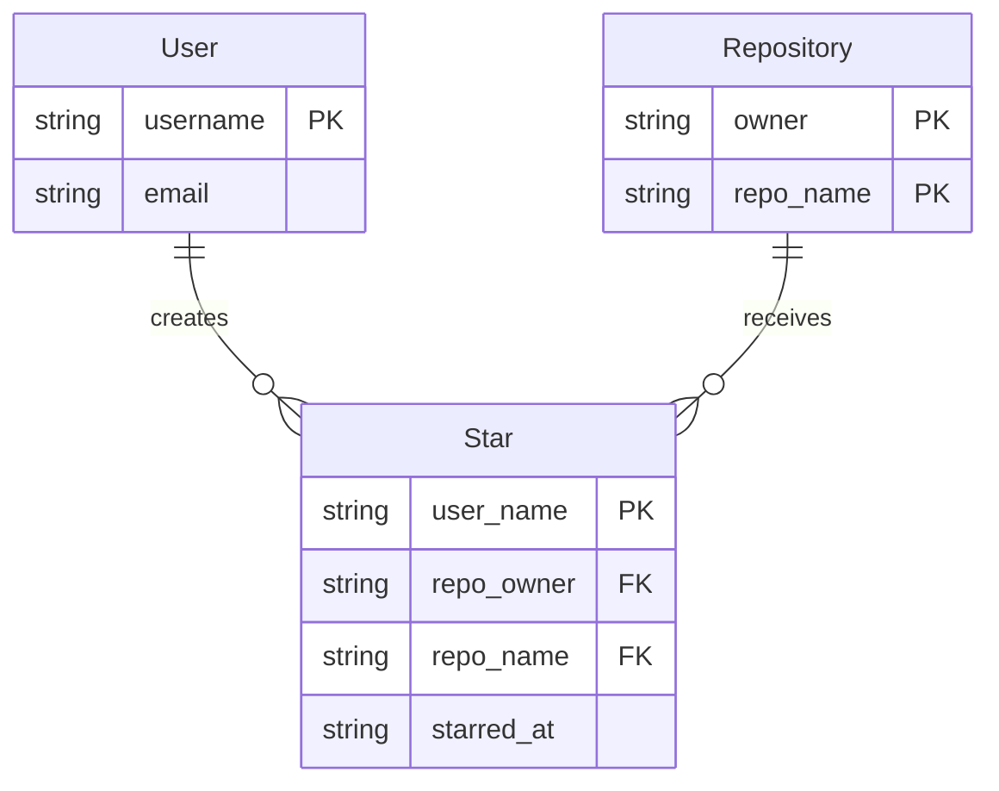

# Star Feature Specification

## Feature Overview

**Phase:** 2.5 - Star Relationships
**Dependencies:** core-entities (User, Organization, Repository)
**Feature ID:** stars
**Implementation Status:** NOT STARTED - This is a design specification for future implementation

### User Story
As a GitHub user, I want to star repositories I'm interested in, so that I can bookmark repos for later reference and show appreciation for projects I find valuable.

## Implementation Status

**Current State:** This feature has NOT been implemented. The specification documents the Star entity that enables many-to-many relationships between users and repositories.

**What Exists:**
- Core entities (User, Organization, Repository) fully implemented
- DynamoDB table with GSI1, GSI2, GSI3, GSI4 configured
- Entity transformation patterns established
- Reaction entity implemented (similar access patterns)

**What Needs to be Built:**
- Star entity record in DynamoDB-Toolbox schema
- StarEntity class for business logic
- StarRepository class for data access
- Test files for Star entity and repository
- API endpoints for starring/unstarring (optional)

## Acceptance Criteria

### AC-1: User Can Star a Repository
**GIVEN** a user exists and a repository exists
**WHEN** the user stars the repository
**THEN** a Star relationship is created with `PK=ACCOUNT#{username}` and `SK=STAR#{owner}#{repo}#{timestamp}`

### AC-2: User Can Unstar a Repository
**GIVEN** a user has starred a repository
**WHEN** the user unstars the repository
**THEN** the Star relationship is removed

### AC-3: List Repositories a User Has Starred
**GIVEN** a user has starred multiple repositories
**WHEN** querying the user's starred repos
**THEN** all starred repositories are returned sorted by star timestamp (most recent first)

### AC-4: List Users Who Starred a Repository
**GIVEN** multiple users have starred a repository
**WHEN** querying the repository's stargazers
**THEN** all users who starred the repo are returned via GSI1

### AC-5: Check if User Has Starred a Repository
**GIVEN** a user and repository
**WHEN** checking star status
**THEN** a direct GetItem query determines if the relationship exists

### AC-6: Prevent Duplicate Stars
**GIVEN** a user has already starred a repository
**WHEN** attempting to star it again
**THEN** the operation is idempotent (no duplicate created, no error thrown)

## Business Rules

| Rule | Description | Rationale |
|------|-------------|-----------|
| BR-1 | A user can star a repository only once | Prevents duplicate relationships and maintains data integrity |
| BR-2 | Stars must reference valid users and repositories | Referential integrity - prevents orphaned stars |
| BR-3 | Timestamps must be recorded when stars are created | Enables chronological sorting and audit trails |
| BR-4 | Unstarring is idempotent - no error if already unstarred | Improves API usability and prevents client-side complexity |
| BR-5 | Stars are bidirectional queryable (user→repos, repo→users) | Required for both "my starred repos" and "repo stargazers" features |

## Technical Implementation Details

### DynamoDB Table Design

#### Entity-Relationship Diagram



#### Key Design Pattern

Stars use the **Adjacency List Pattern** with a GSI for bidirectional queries:

**Direction 1: User → Repos (Main Table)**
```
PK: ACCOUNT#{username}
SK: STAR#{repo_owner}#{repo_name}#{timestamp}
```

**Direction 2: Repo → Users (GSI1)**
```
GSI1PK: REPO#{repo_owner}#{repo_name}
GSI1SK: STAR#{username}#{timestamp}
```

This pattern enables:
- Fast queries in both directions
- Chronological ordering (newest stars first)
- Efficient existence checks via GetItem

### Access Patterns

| Pattern | Query Type | Index | PK | SK/Filter |
|---------|------------|-------|----|---------  |
| Star a repository | PutItem | Main | `ACCOUNT#{username}` | `STAR#{owner}#{repo}#{timestamp}` |
| Unstar a repository | DeleteItem | Main | `ACCOUNT#{username}` | `STAR#{owner}#{repo}#{timestamp}` |
| List user's starred repos | Query | Main | `ACCOUNT#{username}` | `begins_with(STAR#)` |
| List repo stargazers | Query | GSI1 | `REPO#{owner}#{repo}` | `begins_with(STAR#)` |
| Check if starred | GetItem | Main | `ACCOUNT#{username}` | `STAR#{owner}#{repo}#{timestamp}` |

### DynamoDB Schema

```typescript
const StarRecord = new Entity({
  name: 'Star',
  table: GitHubTable,
  schema: item({
    // Business attributes
    user_name: string().required().key(),
    repo_owner: string().required().key(),
    repo_name: string().required().key(),
    starred_at: string()
      .default(() => new Date().toISOString())
      .savedAs('starred_at')
  }).and((_schema) => ({
    // Direction 1: User -> Repos they've starred
    PK: string()
      .key()
      .link<typeof _schema>(({ user_name }) => `ACCOUNT#${user_name}`),
    SK: string()
      .key()
      .link<typeof _schema>(
        ({ repo_owner, repo_name, starred_at }) =>
          `STAR#${repo_owner}#${repo_name}#${starred_at}`
      ),
    // Direction 2: Repo -> Users who starred it (via GSI1)
    GSI1PK: string().link<typeof _schema>(
      ({ repo_owner, repo_name }) => `REPO#${repo_owner}#${repo_name}`
    ),
    GSI1SK: string().link<typeof _schema>(
      ({ user_name, starred_at }) => `STAR#${user_name}#${starred_at}`
    )
  }))
} as const);
```

### StarEntity Class

```typescript
import { DateTime } from 'luxon';
import type { StarFormatted, StarInput } from '../../repos';

type StarEntityOpts = {
  userName: string;
  repoOwner: string;
  repoName: string;
  starredAt?: DateTime;
};

type StarCreateRequest = {
  user_name: string;
  repo_owner: string;
  repo_name: string;
};

type StarResponse = {
  user_name: string;
  repo_owner: string;
  repo_name: string;
  starred_at: string;
};

class StarEntity {
  public readonly userName: string;
  public readonly repoOwner: string;
  public readonly repoName: string;
  public readonly starredAt: DateTime;

  constructor({ userName, repoOwner, repoName, starredAt }: StarEntityOpts) {
    this.userName = userName;
    this.repoOwner = repoOwner;
    this.repoName = repoName;
    this.starredAt = starredAt ?? DateTime.utc();
  }

  public static fromRequest(data: StarCreateRequest): StarEntity {
    return new StarEntity({
      userName: data.user_name,
      repoOwner: data.repo_owner,
      repoName: data.repo_name
    });
  }

  public static fromRecord(record: StarFormatted): StarEntity {
    return new StarEntity({
      userName: record.user_name,
      repoOwner: record.repo_owner,
      repoName: record.repo_name,
      starredAt: DateTime.fromISO(record.starred_at)
    });
  }

  public toRecord(): StarInput {
    return {
      user_name: this.userName,
      repo_owner: this.repoOwner,
      repo_name: this.repoName,
      starred_at: this.starredAt.toISO() ?? ''
    };
  }

  public toResponse(): StarResponse {
    return {
      user_name: this.userName,
      repo_owner: this.repoOwner,
      repo_name: this.repoName,
      starred_at: this.starredAt.toISO() ?? ''
    };
  }
}

export { StarEntity };
export type { StarEntityOpts, StarCreateRequest, StarResponse };
```

### StarRepository Class

```typescript
import {
  ConditionalCheckFailedException,
  TransactionCanceledException
} from '@aws-sdk/client-dynamodb';
import {
  ConditionCheck,
  DeleteItemCommand,
  DynamoDBToolboxError,
  GetItemCommand,
  PutItemCommand,
  QueryCommand
} from 'dynamodb-toolbox';
import { PutTransaction } from 'dynamodb-toolbox/entity/actions/transactPut';
import { execute } from 'dynamodb-toolbox/entity/actions/transactWrite';
import { StarEntity } from '../services/entities/StarEntity';
import { ValidationError } from '../shared';
import {
  decodePageToken,
  encodePageToken,
  type GithubTable,
  type StarRecord,
  type StarFormatted,
  type RepoRecord,
  type UserRecord
} from './schema';

type ListOptions = {
  limit?: number;
  offset?: string;
};

export class StarRepository {
  private readonly table: GithubTable;
  private readonly starRecord: StarRecord;
  private readonly repoRecord: RepoRecord;
  private readonly userRecord: UserRecord;

  constructor(
    table: GithubTable,
    starRecord: StarRecord,
    repoRecord: RepoRecord,
    userRecord: UserRecord
  ) {
    this.table = table;
    this.starRecord = starRecord;
    this.repoRecord = repoRecord;
    this.userRecord = userRecord;
  }

  /**
   * Create a star relationship
   * Validates that both user and repository exist
   */
  async create(star: StarEntity): Promise<StarEntity> {
    try {
      // Build transaction to put star with duplicate check
      const putStarTransaction = this.starRecord
        .build(PutTransaction)
        .item(star.toRecord())
        .options({ condition: { attr: 'PK', exists: false } });

      // Build condition checks to verify user and repo exist
      const userCheckTransaction = this.userRecord
        .build(ConditionCheck)
        .key({ username: star.userName })
        .condition({ attr: 'PK', exists: true });

      const repoCheckTransaction = this.repoRecord
        .build(ConditionCheck)
        .key({
          owner: star.repoOwner,
          repo_name: star.repoName
        })
        .condition({ attr: 'PK', exists: true });

      // Execute all in a transaction
      await execute(
        putStarTransaction,
        userCheckTransaction,
        repoCheckTransaction
      );

      return star;
    } catch (error: unknown) {
      if (
        error instanceof TransactionCanceledException ||
        error instanceof ConditionalCheckFailedException
      ) {
        // Check if it's a duplicate star (idempotent operation)
        const existing = await this.get(
          star.userName,
          star.repoOwner,
          star.repoName
        );

        if (existing) {
          return existing; // Idempotent - return existing star
        }

        // Not a duplicate, must be missing user or repo
        throw new ValidationError(
          'star',
          `User '${star.userName}' or repository '${star.repoOwner}/${star.repoName}' does not exist`
        );
      }
      if (error instanceof DynamoDBToolboxError) {
        throw new ValidationError(error.path ?? 'star', error.message);
      }
      throw error;
    }
  }

  /**
   * Get a specific star relationship
   */
  async get(
    userName: string,
    repoOwner: string,
    repoName: string
  ): Promise<StarEntity | undefined> {
    // Note: We need the timestamp to construct the full SK
    // Query instead of GetItem since we don't know the exact timestamp
    const result = await this.table
      .build(QueryCommand)
      .entities(this.starRecord)
      .query({
        partition: `ACCOUNT#${userName}`,
        range: { beginsWith: `STAR#${repoOwner}#${repoName}#` }
      })
      .options({ limit: 1 })
      .send();

    const items = result.Items || [];
    return items.length > 0
      ? StarEntity.fromRecord(items[0] as StarFormatted)
      : undefined;
  }

  /**
   * Delete a star relationship
   */
  async delete(
    userName: string,
    repoOwner: string,
    repoName: string
  ): Promise<void> {
    // First find the star to get the exact timestamp
    const star = await this.get(userName, repoOwner, repoName);

    if (!star) {
      return; // Idempotent - no error if already unstarred
    }

    await this.starRecord
      .build(DeleteItemCommand)
      .key({
        user_name: userName,
        repo_owner: repoOwner,
        repo_name: repoName,
        starred_at: star.starredAt.toISO() ?? ''
      })
      .send();
  }

  /**
   * List repositories a user has starred
   * Sorted by starred_at (newest first)
   */
  async listByUser(
    userName: string,
    options: ListOptions = {}
  ): Promise<{ items: StarEntity[]; offset?: string }> {
    const { limit = 50, offset } = options;

    const result = await this.table
      .build(QueryCommand)
      .entities(this.starRecord)
      .query({
        partition: `ACCOUNT#${userName}`,
        range: { beginsWith: 'STAR#' }
      })
      .options({
        reverse: true, // Newest stars first
        exclusiveStartKey: decodePageToken(offset),
        limit
      })
      .send();

    const items =
      result.Items?.map((item) =>
        StarEntity.fromRecord(item as StarFormatted)
      ) || [];

    return {
      items,
      offset: encodePageToken(result.LastEvaluatedKey)
    };
  }

  /**
   * List users who starred a repository
   * Sorted by starred_at (newest first)
   */
  async listByRepo(
    repoOwner: string,
    repoName: string,
    options: ListOptions = {}
  ): Promise<{ items: StarEntity[]; offset?: string }> {
    const { limit = 50, offset } = options;

    const result = await this.table
      .build(QueryCommand)
      .entities(this.starRecord)
      .query({
        index: 'GSI1',
        partition: `REPO#${repoOwner}#${repoName}`,
        range: { beginsWith: 'STAR#' }
      })
      .options({
        reverse: true, // Newest stars first
        exclusiveStartKey: decodePageToken(offset),
        limit
      })
      .send();

    const items =
      result.Items?.map((item) =>
        StarEntity.fromRecord(item as StarFormatted)
      ) || [];

    return {
      items,
      offset: encodePageToken(result.LastEvaluatedKey)
    };
  }

  /**
   * Check if a user has starred a repository
   */
  async isStarred(
    userName: string,
    repoOwner: string,
    repoName: string
  ): Promise<boolean> {
    const star = await this.get(userName, repoOwner, repoName);
    return star !== undefined;
  }
}
```

### Repository Operations

#### StarRepository Methods
- `create(star: StarEntity): Promise<StarEntity>` - Create star with validation
- `get(userName, repoOwner, repoName): Promise<StarEntity | undefined>` - Get specific star
- `delete(userName, repoOwner, repoName): Promise<void>` - Remove star (idempotent)
- `listByUser(userName, options?): Promise<PaginatedResponse<StarEntity>>` - User's starred repos
- `listByRepo(repoOwner, repoName, options?): Promise<PaginatedResponse<StarEntity>>` - Repo stargazers
- `isStarred(userName, repoOwner, repoName): Promise<boolean>` - Check star status

## Implementation Sequence

1. **Add Star entity to DynamoDB-Toolbox schema** (`/src/repos/schema.ts`)
2. **Create StarEntity class** (`/src/services/entities/StarEntity.ts`)
3. **Create StarRepository class** (`/src/repos/StarRepository.ts`)
4. **Write comprehensive tests** (`/src/repos/StarRepository.test.ts`)
5. **Add to schema exports** (update `GithubSchema` type and `initializeSchema` function)
6. **Optional: Create API endpoints** (`/src/routes/StarRoutes.ts`)

## Example Usage

```typescript
// Star a repository
const star = StarEntity.fromRequest({
  user_name: 'john',
  repo_owner: 'aws',
  repo_name: 'dynamodb-toolbox'
});
await starRepository.create(star);

// List user's starred repos
const { items, offset } = await starRepository.listByUser('john', { limit: 20 });

// List repo stargazers
const { items: stargazers } = await starRepository.listByRepo('aws', 'dynamodb-toolbox');

// Check if starred
const isStarred = await starRepository.isStarred('john', 'aws', 'dynamodb-toolbox');

// Unstar
await starRepository.delete('john', 'aws', 'dynamodb-toolbox');
```

## Testing Strategy

### Unit Tests
- StarEntity transformation methods (fromRequest, toRecord, toResponse)
- Key generation logic (PK, SK, GSI1PK, GSI1SK)

### Integration Tests (with DynamoDB Local)
- Create star with valid user and repo
- Create star with non-existent user (should fail)
- Create star with non-existent repo (should fail)
- Create duplicate star (should be idempotent)
- Delete star (should succeed)
- Delete non-existent star (should be idempotent)
- List user's starred repos (with pagination)
- List repo stargazers (with pagination)
- Check star status

## Scope

### Included Features
- Star entity with DynamoDB-Toolbox schema
- StarEntity class with transformation methods
- StarRepository with bidirectional queries
- Pagination support for list operations
- Idempotent star/unstar operations
- Referential integrity validation

### Excluded Features
- Star count aggregation (can be computed from queries)
- Star activity feed
- Star notifications
- API rate limiting for starring
- Bulk star operations

## Dependencies

- **core-entities** - Requires User and Repository entities (✅ IMPLEMENTED)
- DynamoDB table with GSI1 configured (✅ EXISTS)

## Next Steps

This specification is ready for implementation following the established patterns:

1. Add StarRecord to `/src/repos/schema.ts`
2. Create `/src/services/entities/StarEntity.ts`
3. Create `/src/repos/StarRepository.ts`
4. Create `/src/repos/StarRepository.test.ts`
5. Update schema exports in `/src/repos/schema.ts`
6. Validate against blog post examples in Part 2
